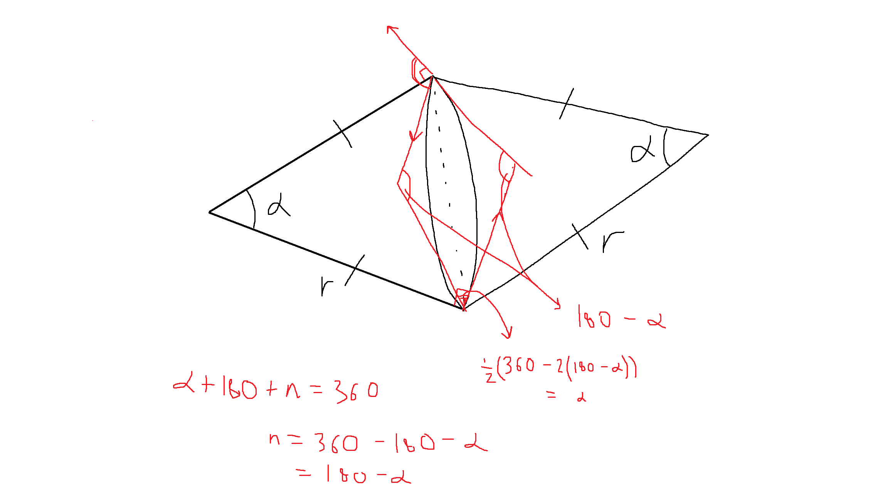
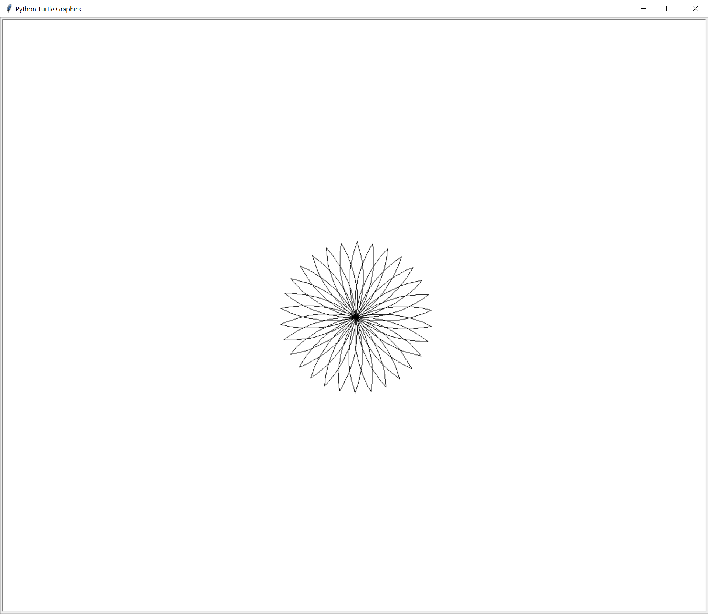
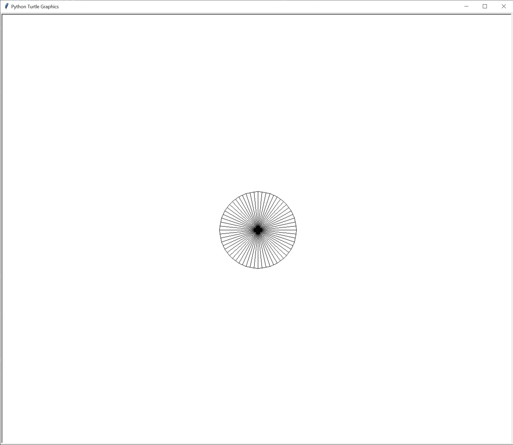
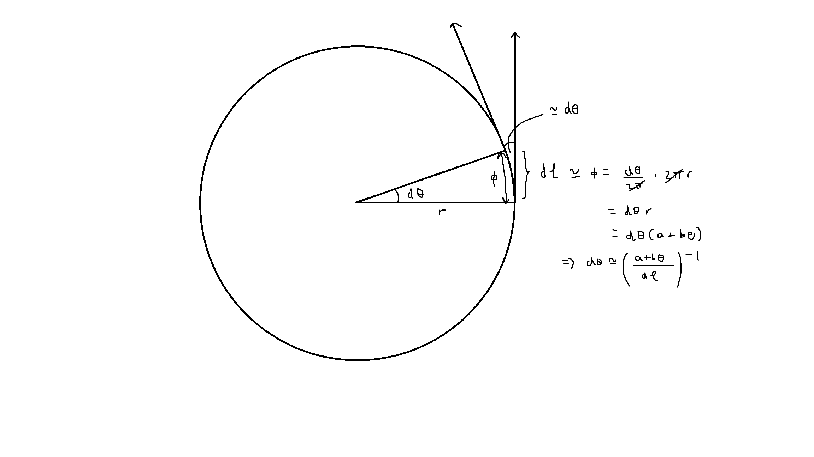
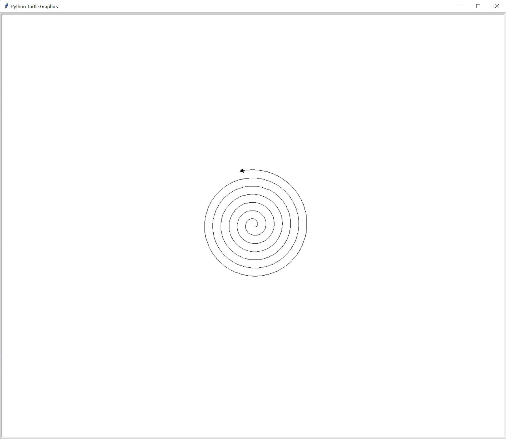

# Chapter 4 notes

## Exercise 4-1

Figure out angle for the lower petal:

Output:

## Exercise 4-3

Output:

## Exercise 4-5

Figure out continuous angle approximation for Turtle drawing spiral:

Output:

